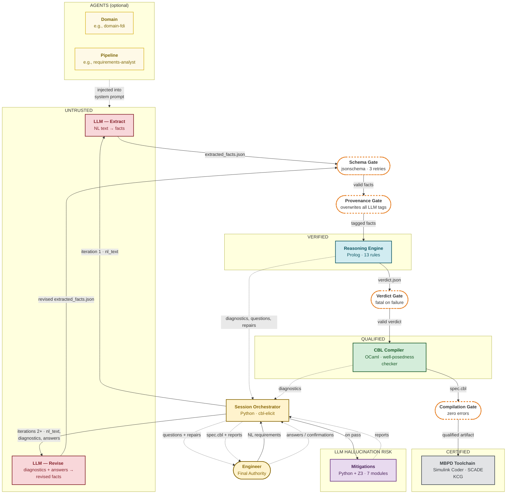
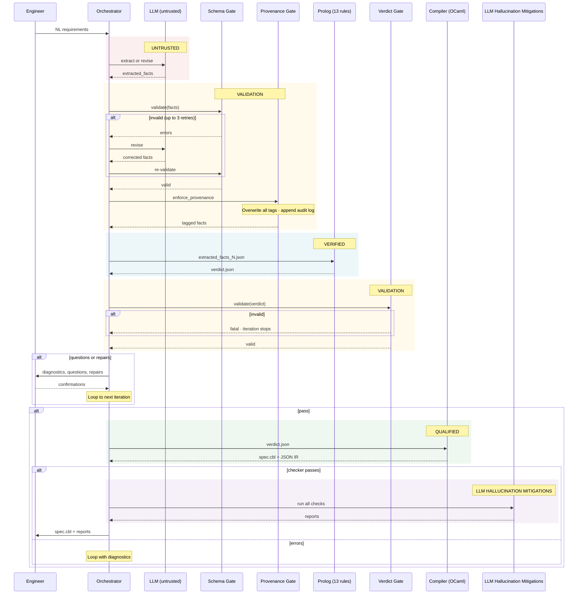

# CBL System Architecture (DRAFT)
> The architecture is an early reserach prototype and is still evolving. This is not ready for prime time. 

## Overview

CBL (Controlled Behavioral Language) converts natural-language requirements into verified behavioral specifications. The system uses a three-layer pipeline with strict trust boundaries: an untrusted LLM proposes specifications, deterministic engines verify and refine them, and a human engineer holds final authority.

The output is a well-posed CBL specification that compiles to JSON IR for certified MBPD toolchains (Simulink Coder, SCADE KCG).

## Container Diagram

### Trust Zone Summary

| Zone | Components | Trust Basis | Verification Method |
|------|-----------|-------------|---------------------|
| **Untrusted** | LLM (extract + revise) | Statistical model; may hallucinate | All output gated by schema + provenance + downstream checks |
| **Agent Instructions** | Domain agents, pipeline agents (`.agent.md`) | User-authored; injected into LLM system prompt | Content reviewed by engineer; does not bypass validation gates |
| **Mitigated** | 7 LLM hallucination mitigation modules | Deterministic, no LLM in checking path | 74 unit tests; no statistical components |
| **Verified** | Prolog reasoning engine | Rule-based, 13 consistency rules | Deterministic; same input always produces same output |
| **Qualified** | OCaml compiler | Type-safe, exhaustive pattern matching | CompCert lineage; qualified tool assumption (DO-178C §12.2) |
| **Certified** | MBPD toolchain | Independently certified code generators | Vendor-supplied qualification kits |
| **Authoritative** | Engineer + audit log | Human judgment; append-only record | Provenance audit log is deterministic and inspectable |

The three validation gates (Schema, Provenance, Verdict) are deterministic Python code within the Session orchestrator (`cbl-elicit/session.py`). They enforce trust boundaries between zones but do not constitute a separate trust zone.

### Validation Gates

Three gates prevent untrusted data from reaching trusted components:

1. **Schema Gate** (LLM → Prolog): `extracted_facts.schema.json` enforced by Python `jsonschema`. Retries the LLM up to 3 times on failure; aborts if still invalid. Provenance tags constrained to a 7-value enum.

2. **Provenance Gate** (LLM → Prolog): Unconditional. The orchestrator overwrites every provenance tag the LLM assigns. Facts matching engineer text become `user_stated`; previously confirmed facts become `user_confirmed`; everything else is forced to `llm_inferred`, which triggers Prolog rule R9 (engineer must confirm before the fact is committed).

3. **Verdict Gate** (Prolog → OCaml): `verdict.schema.json` enforced by Python. Fatal on failure: a malformed Prolog verdict stops the iteration immediately rather than propagating to OCaml.

### Reasoning Rules (Prolog)

The 13 consistency rules in `cbl-prolog/consistency.pl` partition into errors (block compilation) and warnings (flag for review).

| Rule | Name | Description |
|------|------|-------------|
| R1 | Empty mode | Every mode must have at least one transition. |
| R2 | Guard completeness | Every mode needs an `Otherwise` clause (syntactic totality). |
| R3 | Action totality | Every transition must assign all guarantees that lack a default. |
| R4 | Invalid target | Transition target must reference a declared mode. |
| R5 | Invalid initial | The declared initial mode must exist. |
| R5b | No initial mode | At least one initial mode must be declared. |
| R6 | Duplicate declarations | No name may appear in more than one namespace. |
| R7 | Undeclared reference | Every name in guards, actions, predicates, or entry actions must be declared. |
| R8 | Unknown constant | Constants with value `__unknown__` block compilation. |
| R9 | Unconfirmed inference | Facts with `llm_inferred` provenance block compilation until confirmed. |
| R9b | Unconfirmed default | Guarantee defaults with `llm_inferred` provenance are flagged. |
| R10 | Guard exclusivity | Heuristic warning when two guards in the same mode are not syntactically exclusive. |
| R11 | Type checking | Inferred type of a `set` action must be compatible with the guarantee's declared type. |
| R12 | Reachability | Warn if a mode is unreachable from the initial mode (tabled transitive closure). |
| R13 | Unused declaration | Warn if a declared name is never referenced. |

R5b and R9b are sub-rules of their parents. R14 was removed (entry-action undeclared references are caught by R7).

### LLM Hallucination Mitigation Modules

Seven post-success checks in `cbl-elicit/mitigations/`, all deterministic (no LLM in the checking path).

| Module | Description |
|--------|-------------|
| `back_translation` | Renders the CBL spec back to plain English for side-by-side comparison with original requirements. |
| `dual_extraction` | Runs LLM extraction twice with different prompts; structurally diffs results to flag divergences. |
| `mutation_testing` | Generates AST-level mutants (flipped guards, swapped targets, dropped assignments) and checks detection. |
| `pattern_justification` | Validates that every domain-pattern recommendation cites a real requirement with plausible term overlap. |
| `provenance_control` | Assigns provenance tags deterministically from the orchestrator; maintains append-only audit log. |
| `traceability` | Verifies every fact cites a real requirement fragment and every requirement is covered (surjectivity). |
| `z3_guard_checker` | Uses Z3 SMT queries for guard exclusivity and completeness, strengthening Prolog R2/R10. |

## Data Formats

All inter-layer communication uses JSON with explicit schemas.

| Artifact | Producer | Consumer | Schema |
|----------|----------|----------|--------|
| `extracted_facts_N.json` | LLM (Layer 1) | Prolog (Layer 2) | `cbl-elicit/schema/extracted_facts.schema.json` |
| `verdict_N.json` | Prolog (Layer 2) | OCaml (Layer 3) | `cbl-elicit/schema/verdict.schema.json` |
| `spec.cbl` | OCaml (Layer 3) | Engineer / MBPD | CBL grammar (EBNF in compiler) |
| `provenance_audit.json` | Orchestrator | Auditor | Append-only log; timestamped entries |

### Provenance Tags

Every semantic value in `extracted_facts.json` is wrapped as `{value, provenance}`. The orchestrator (not the LLM) assigns these tags:

| Tag | Meaning | Assigned By |
|-----|---------|-------------|
| `user_stated` | Engineer wrote this in original requirements | Orchestrator (NL fragment match) |
| `user_confirmed` | Engineer explicitly approved | Orchestrator (confirmation tracking) |
| `llm_inferred` | LLM proposed, not yet confirmed | Orchestrator (default for all LLM output) |
| `default_assumed` | System default (e.g., initial values) | Orchestrator |
| `rule_derived` | Prolog derived from confirmed premises | Prolog engine |
| `rule_derived_pending` | Prolog derived from unconfirmed premises | Prolog engine |
| `user_rejected` | Engineer rejected | Orchestrator |

## Formal Semantics

A well-posed CBL specification defines a Mealy machine:

$$\mathcal{M} = (S,\; U,\; X,\; Y,\; s_0,\; x_0,\; \delta,\; \lambda)$$

| Symbol | Meaning |
|--------|---------|
| $S$ | Finite set of modes (states) |
| $U$ | Input space (all `Assumes` variables) |
| $X$ | Internal state (`Variables` + synthesized counters) |
| $Y$ | Output space (all `Guarantees` variables) |
| $s_0$ | Initial mode |
| $x_0$ | Initial internal state |
| $\delta: S \times U \times X \to S \times X$ | Transition function |
| $\lambda: S \times U \times X \to Y$ | Output function |

**Well-posedness conditions** (all enforced by the OCaml checker):

1. **Guard exclusivity**: At most one guard fires per mode and input.
2. **Guard completeness**: At least one guard fires (including Otherwise).
3. **Action totality**: Every transition assigns all guaranteed outputs.

**Theorem**: A well-posed CBL specification yields a deterministic, total transition system.

## Key Assumptions

1. **LLM is untrusted**: It may hallucinate facts, invent requirements, or assign false provenance. All output is gated.
2. **Provenance enforcement is unconditional**: No configuration can bypass it. The orchestrator overwrites all LLM provenance tags on every iteration.
3. **OCaml compiler is a qualified tool**: Its acceptance is the final structural gate before downstream certified code generation.
4. **Engineer confirmation is authoritative**: Recorded in the append-only audit log. Prolog treats confirmed facts as committed.
5. **Downstream MBPD tools are independently certified**: Simulink Coder and SCADE KCG carry their own DO-178C / ISO 26262 qualification.
6. **Pre-enforcement JSON is preserved**: `extracted_facts_N.json` written to `work_dir` before provenance enforcement, enabling post-hoc audit of raw LLM output.

## TODO

- [ ] Replace the Mermaid container diagram with a manually drawn image and embed it here.

## Known Gaps (deferred, low priority)

- **Prolog input validation**: `bridge.pl` does not schema-validate its JSON input. Not exploitable through the orchestrator (Python validates first), but matters if Prolog is invoked standalone.
- **OCaml schema validation**: `nlp_bridge.ml` uses ad-hoc field parsing rather than JSON Schema. The well-posedness checker provides stronger semantic validation.
- **Language consolidation**: The repo currently uses three in-repo languages (Python, Prolog, OCaml). The 13 Prolog consistency rules could be absorbed into the OCaml compiler as a `reasoning` module, reducing to two languages aligned with the trust boundary: Python (orchestrator, untrusted/mitigated layer) and OCaml (everything deterministic, verified/qualified layer).

---

## Iteration Sequence Diagram

The following shows one complete iteration through the pipeline, including all validation gates and the engineer interaction points.

### Iteration Protocol

1. **Extract**: LLM produces `extracted_facts` (or revises based on prior diagnostics).
2. **Schema validate**: Python `jsonschema` enforces structure. Up to 3 retries on failure; abort if exhausted.
3. **Provenance enforce**: Orchestrator overwrites all provenance tags. Audit log appended.
4. **Prolog reason**: 13 consistency rules fire. Repairs and questions generated. Facts partitioned into committed vs. pending.
5. **Verdict validate**: Schema enforced. Fatal on failure.
6. **Engineer interact**: Diagnostics, questions, and repair proposals presented. Engineer confirms or rejects.
7. **OCaml compile** (on pass): Well-posedness checker runs. If errors, diagnostics feed back into next iteration.
8. **LLM Hallucination Mitigations**: Back-translation, traceability, Z3 guard analysis, mutation testing, pattern justification.
9. **Stall detection**: If 2 consecutive iterations show no improvement, engineer offered manual resolution or abort.
10. **Termination**: Success when OCaml passes, or max iterations (default 10) exhausted.
