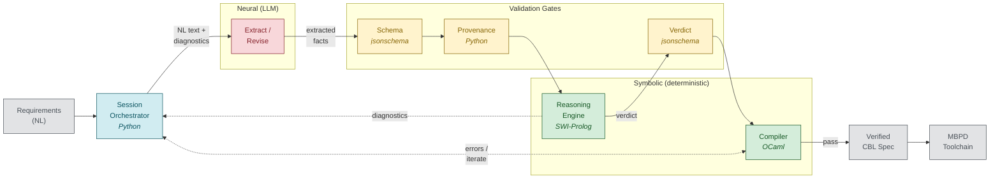

# CBL: Controlled Behavioral Language

A structured specification language for state-based behavior, designed to bridge the gap between natural-language requirements and verified behavioral models in Model-Based Design (MBD) workflows.

CBL targets certified embedded systems pipelines (DO-178C, ISO 26262) where requirements must be translated into models consumed by qualified code generators (Simulink Coder, SCADE KCG).

> **Status**: This is a research prototype, not production software. APIs, file formats, and language syntax may change without notice.

## Pipeline



1. **cbl-elicit** (Python): LLM-assisted extraction of behavioral facts from natural-language requirements. Enforces provenance, schema validation, and hallucination mitigations.
2. **cbl-prolog** (SWI-Prolog): Rule-based consistency checking, repair suggestions, and diagnostic generation.
3. **cbl-compiler** (OCaml): Well-posedness checking, type verification, and artifact emission.

The LLM participates only in requirements elicitation. All downstream reasoning, checking, and code generation is deterministic.

## Prerequisites

- Python 3.12+
- SWI-Prolog 9.0+
- OCaml 4.14+ with opam (dune, menhir, yojson, z3)

## Quick Start

### Install Python dependencies

```bash
pip install -r requirements.txt
```

### Install OCaml dependencies

```bash
cd cbl-compiler
opam install . --deps-only
dune build
```

### Run the test suites

```bash
# Python (elicitation + mitigations)
python -m pytest cbl-elicit/test -q

# OCaml (compiler + checker)
cd cbl-compiler && dune test

# Prolog (fixture-based)
swipl -g main -t halt cbl-prolog/run.pl -- \
  --input cbl-prolog/test/fdi_extracted.json \
  --output /tmp/fdi_verdict.json
```

### Run a specification pipeline (example)

```bash
python -m cbl-elicit --input requirements.txt --output spec.cbl
```

## Repository Structure

```
cbl-elicit/          Python orchestration, LLM extraction, hallucination mitigations
cbl-prolog/          Prolog consistency rules, repair, question generation
cbl-compiler/        OCaml compiler: parser, checker, JSON IR emitter
docs/                Papers and architecture documentation
  MPBD.embedded.pdf  Model & Platform Based Design paper
  cbl_overview.pdf   CBL language overview
```

## Architecture

See [ARCHITECTURE.md](ARCHITECTURE.md) for the full system architecture, trust boundaries, and defense-in-depth design.

## Documentation

- [MPBD Paper](docs/MPBD.embedded.pdf): Model and Platform Based Design of Embedded Systems
- [CBL Overview](docs/cbl_overview.pdf): Language overview and formal semantics
- [Compiler Guide](cbl-compiler/GETTING_STARTED.md): Getting started with the OCaml compiler

## License

[MIT](LICENSE)
