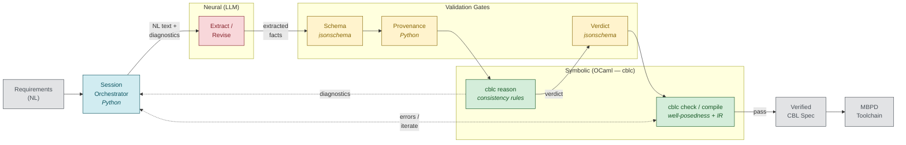

# CBL: Controlled Behavioral Language

A structured specification language for state-based behavior, designed to bridge the gap between natural-language requirements and verified behavioral models in Model-Based Design (MBD) workflows.

CBL targets certified embedded systems pipelines (DO-178C, ISO 26262) where requirements must be translated into models consumed by qualified code generators (Simulink Coder, SCADE KCG).

> **Status**: This is a research prototype, not production software. APIs, file formats, and language syntax may change without notice.

## Pipeline


```mermaid
flowchart LR
    classDef neural fill:#f8d7da,stroke:#842029,color:#842029
    classDef symbolic fill:#d4edda,stroke:#155724,color:#155724
    classDef gate fill:#fff3cd,stroke:#856404,color:#856404
    classDef ext fill:#e2e3e5,stroke:#495057,color:#495057
    classDef orch fill:#d1ecf1,stroke:#0c5460,color:#0c5460

    NL["Requirements<br>(NL)"]:::ext
    ORCH["Session<br>Orchestrator<br><i>Python</i>"]:::orch

    NL --> ORCH

    subgraph NEURAL ["Neural (LLM)"]
        E["Extract /<br>Revise"]:::neural
    end

    ORCH -- "NL text +<br>diagnostics" --> E
    E -- "extracted<br>facts" --> G1

    subgraph GATES ["Validation Gates"]
        G1["Schema<br><i>jsonschema</i>"]:::gate
        G2["Provenance<br><i>Python</i>"]:::gate
        G3["Verdict<br><i>jsonschema</i>"]:::gate
    end
    G1 --> G2

    subgraph SYMBOLIC ["Symbolic (OCaml — cblc)"]
        R["cblc reason<br><i>consistency rules</i>"]:::symbolic
        C["cblc check / compile<br><i>well-posedness + IR</i>"]:::symbolic
    end

    G2 --> R
    R -- "verdict" --> G3
    G3 --> C

    R -. "diagnostics" .-> ORCH
    C <-. "errors /<br>iterate" .-> ORCH

    C -- "pass" --> OUT["Verified<br>CBL Spec"]:::ext
    OUT --> MBPD["MBPD<br>Toolchain"]:::ext
```

1. **cbl-elicit** (Python): LLM-assisted extraction of behavioral facts from natural-language requirements. Enforces provenance, schema validation, and hallucination mitigations.
2. **cbl-compiler** (OCaml): A single `cblc` binary handling rule-based consistency reasoning (`cblc reason`), well-posedness checking (`cblc check`), and JSON IR compilation (`cblc compile` / `cblc ingest`). The reasoning engine — previously a separate SWI-Prolog component — was merged into the OCaml compiler.

The LLM participates only in requirements elicitation. All downstream reasoning, checking, and code generation is deterministic.

## Authoring surfaces

Two optional tools support authors and reviewers; neither is required to run the pipeline.

- **vscode-cbl** — VS Code extension providing TextMate syntax highlighting for `.cbl` files and on-save diagnostics from `cblc check`. For spec authors who edit CBL directly.
- **.claude/skills** — Claude Code skills:
  - `cbl-elicit` runs a structured discovery session that builds a `.cbl` file from a natural-language conversation, hiding the syntax from the user.
  - `cbl-explain` produces plain-English summaries of `.cbl` files for stakeholders and certifiers who should not read CBL syntax.

## Prerequisites

- Python 3.12+
- OCaml 4.14+ with opam (dune, menhir, yojson, z3)

## Quick Start

### Install Python dependencies

```bash
pip install -r requirements.txt
```

### Install OCaml dependencies

```bash
cd cbl-compiler
opam install . --deps-only
dune build
```

### Run the test suites

```bash
# Python (elicitation + mitigations)
python -m pytest cbl-elicit/test -q

# OCaml (compiler + checker + reasoning)
cd cbl-compiler && dune test
```

### Run the reasoning engine standalone

```bash
cbl-compiler/_build/default/bin/cblc.exe reason extracted_facts.json -o verdict.json
```

### Run a specification pipeline (example)

```bash
python -m cbl-elicit --input requirements.txt --output spec.cbl
```

## Repository Structure

```
cbl-elicit/          Python orchestration, LLM extraction, hallucination mitigations
cbl-compiler/        OCaml: parser, well-posedness checker, reasoning engine, JSON IR emitter
vscode-cbl/          VS Code extension (syntax highlighting + cblc check diagnostics)
.claude/skills/      Claude Code skills (cbl-elicit, cbl-explain)
docs/                Papers and architecture documentation
  MBPD.embedded.pdf  Model-Based Design of Embedded Systems
  cbl_overview.pdf   CBL language overview
```

## Architecture

See [ARCHITECTURE.md](ARCHITECTURE.md) for the full system architecture, trust boundaries, and defense-in-depth design.

## Documentation

- [MBPD Paper](docs/MBPD.embedded.pdf): Model-Based Design of Embedded Systems
- [CBL Overview](docs/cbl_overview.pdf): Language overview and formal semantics
- [Compiler Guide](cbl-compiler/GETTING_STARTED.md): Getting started with the OCaml compiler

## License

[MIT](LICENSE)
